> **Last updated:** 12th February 2026  
> **Version:** 1.0  
> **Authors:** Gianni TUERO  
> **Status:** Done
> {.is-success}

# Ascension Architecture Documentation

## Overview

Ascension is built on a modern microservices architecture designed to handle computationally intensive AI workloads while maintaining responsiveness for end users. The system separates concerns between user interaction (Rust API), heavy computation (Python AI workers), and data persistence.

## Core Principles

1. **Separation of Concerns**: API layer handles user requests, AI workers handle computation
2. **Asynchronous Processing**: Heavy workloads are queued and processed independently
3. **Edge Rendering**: Client-side rendering of analysis results to minimize bandwidth
4. **Cost Optimization**: Direct video upload to storage, JSON-based result delivery
5. **Scalability**: Independent scaling of API and AI workers based on demand

## Architecture Components

```mermaid
graph TD
    subgraph Client ["📱 Client Layer"]
        MobileApp["Flutter Mobile App"]
    end

    subgraph API ["🛡️ API Gateway - Rust"]
        APIServer["API Server (Axum/Actix)"]
        AuthService["Authentication & WebSocket"]
    end

    subgraph Storage ["🗄️ Data & Storage Layer"]
        ObjectStorage["Object Storage (MinIO/S3)"]
        Database["PostgreSQL"]
        MessageQueue["Redis (Queue & Cache)"]
    end

    subgraph AI ["🤖 AI Processing Layer"]
        WorkerManager["Worker Orchestrator"]
        PoseEstimation["Pose Estimation Service"]
        GhostGenerator["Ghost Climber Generator"]
        HoldRecognition["Hold Recognition Service"]
    end

    MobileApp -->|"1. Request Presigned URL"| APIServer
    APIServer -->|"2. Generate Presigned URL"| ObjectStorage
    MobileApp -->|"3. Direct Upload"| ObjectStorage
    MobileApp -->|"4. Notify Upload Complete"| APIServer

    APIServer -->|"5. Publish Job"| MessageQueue
    MessageQueue -->|"6. Consume Job"| WorkerManager

    WorkerManager --> PoseEstimation
    WorkerManager --> GhostGenerator
    WorkerManager --> HoldRecognition

    PoseEstimation -->|"Fetch Video"| ObjectStorage
    GhostGenerator -->|"Fetch Data"| ObjectStorage

    WorkerManager -->|"7. Store Results (JSON)"| Database
    WorkerManager -->|"8. Publish Complete Event"| MessageQueue

    MessageQueue -->|"9. Notify Ready"| APIServer
    APIServer -->|"10. WebSocket Notification"| MobileApp
    MobileApp -->|"11. Fetch Analysis JSON"| APIServer
    APIServer -->|"12. Retrieve JSON"| Database
```



## Key Features

### Intelligent Upload System

- **Presigned URLs**: Direct upload to object storage bypassing API server
- **No API Bottleneck**: API server only coordinates, doesn't handle video data
- **Security**: Time-limited, scoped access to storage

### Asynchronous Processing

- **Message Queue**: Redis-based job distribution
- **Worker Pool**: Python workers consume jobs independently
- **Non-blocking**: Users can continue using the app during processing

### Lightweight Results

- **JSON-only Response**: ~50KB instead of 50MB video
- **Client-side Rendering**: Flutter CustomPainter overlays analysis on local video
- **Cost Effective**: Minimal data egress from servers

### Lifecycle Management

- **Auto-deletion**: Videos deleted after 24h unless explicitly saved
- **User Control**: Option to persist videos for sharing
- **Privacy First**: Temporary storage by default

## Directory Structure

```
architecture/
├── README.md                          # This file
├── system-overview.md                 # High-level system design
├── deployment/
│   ├── development.md                 # Development environment setup
│   ├── staging.md                     # Staging environment setup
│   └── production.md                  # Production environment setup
├── components/
│   ├── api-gateway.md                 # Rust API server details
│   ├── ai-workers.md                  # Python AI workers details
│   ├── database.md                    # PostgreSQL schema and design
│   ├── storage.md                     # Object storage configuration
│   └── message-queue.md               # Redis queue patterns
├── workflows/
│   ├── video-analysis-flow.md         # Complete video analysis workflow
│   ├── authentication-flow.md         # User authentication flow
│   └── data-lifecycle.md              # Data retention and cleanup
└── diagrams/
    ├── sequence-diagrams.md           # Detailed sequence diagrams
    └── deployment-diagrams.md         # Infrastructure diagrams
```

## Repository Structure

Ascension uses a **monorepo with Git submodules** approach:

```
Ascension/                      # Main repository (orchestration)
├── docker-compose.yml          # Development orchestration
├── .env.example               # Environment template
├── .gitmodules                # Submodule configuration
│
├── server/                    # Submodule: API Gateway
│   └── git@github.com:Ascension-EIP/server.git
│
├── ai/                        # Submodule: AI Workers
│   └── git@github.com:Ascension-EIP/ai.git
│
├── mobile/                    # Submodule: Mobile App
│   └── git@github.com:Ascension-EIP/mobile.git
│       ├── README.md
│       └── app/                       # Application (en développement)
│
├── docs/                      # Submodule: Documentation
│   └── git@github.com:Ascension-EIP/docs.git
│
└── benchmark/                 # Submodule: Performance Tests
    └── git@github.com:Ascension-EIP/benchmark.git
```

**Benefits**:

- Each service has its own repository and version control
- Independent CI/CD pipelines per service
- Teams can work in parallel
- Main repo provides unified development environment

## Technology Stack

### Client Layer

- **Framework**: Flutter
- **State Management**: TBD (Bloc/Riverpod recommended)
- **Video Rendering**: CustomPainter for analysis overlay
- **Networking**: HTTP/2 + WebSocket

### API Gateway

- **Language**: Rust
- **Framework**: Axum or Actix-web
- **Features**:
  - JWT Authentication
  - WebSocket for real-time notifications
  - Presigned URL generation
  - Request validation

### AI Processing

- **Language**: Python 3.10+
- **ML Frameworks**: PyTorch, MediaPipe/OpenPose
- **Services**:
  - Pose Estimation (skeleton extraction)
  - Inverse Kinematics (Ghost Climber generation)
  - Hold Recognition (CNN-based)

### Data Layer

- **Database**: PostgreSQL 15+
- **Object Storage**: MinIO (dev), AWS S3 (prod)
- **Message Queue**: Redis 7+
- **Caching**: Redis

## Deployment Phases

### Phase 1: Development (Single Machine)

- All services in Docker Compose
- Local MinIO for storage
- Suitable for: Development, testing, prototyping

### Phase 2: Staging (Multi-Container)

- API and DB on VPS
- AI workers on GPU-enabled machine (local or cloud)
- Cloud storage (S3 or equivalent)
- Suitable for: Beta testing, performance validation

### Phase 3: Production (Distributed)

- API on managed container service
- Managed database (AWS RDS, Azure Database)
- Managed cache (AWS ElastiCache)
- AI workers on dedicated GPU instances
- CDN for static assets
- Suitable for: Scale (100k+ users)

## Getting Started

1. Read [System Overview](./system-overview.md) for architecture philosophy
2. Review [Development Deployment](./deployment/development.md) to set up local environment
3. Understand [Video Analysis Flow](./workflows/video-analysis-flow.md) for the core feature
4. Explore [Component Documentation](./components/) for detailed specs

## Design Decisions

### Why Rust for API?

- Memory safety without garbage collection
- Exceptional performance for concurrent requests
- Strong typing prevents runtime errors
- Active ecosystem (Axum, Actix-web, SQLx)

### Why Python for AI?

- Industry standard for ML/AI (PyTorch, TensorFlow)
- Rich ecosystem of computer vision libraries
- Fast prototyping and experimentation
- Easy to recruit ML engineers

### Why Separate AI Workers?

- **Performance**: AI inference doesn't block API requests
- **Scaling**: Add more workers during peak times
- **Resource Isolation**: GPU requirements isolated from API server
- **Fault Tolerance**: API remains responsive if AI worker crashes

### Why Redis?

- Fast in-memory operations
- Pub/Sub for real-time notifications
- Job queue capabilities (with reliability)
- Caching layer for frequent queries

### Why Client-side Rendering?

- **Bandwidth**: 50KB JSON vs 50MB video (1000x reduction)
- **Cost**: Minimal data egress charges
- **Speed**: No video re-encoding delay
- **Quality**: User sees original video quality

## Performance Targets

- **Upload Confirmation**: < 100ms (presigned URL)
- **Video Upload**: Network dependent (direct to S3)
- **Analysis Processing**: < 30 seconds for 30-second video
- **Result Delivery**: < 100ms (JSON fetch)
- **Total Time-to-Result**: ~45 seconds (including upload)

## Security Considerations

- JWT-based authentication
- Presigned URLs with 15-minute expiration
- HTTPS/TLS for all external communication
- Network isolation for database and Redis
- Rate limiting on API endpoints
- Input validation on all user data

## Monitoring & Observability

- **Metrics**: Prometheus for time-series data
- **Logging**: Structured JSON logs
- **Tracing**: OpenTelemetry for distributed tracing
- **Alerting**: Critical failure notifications
- **Dashboards**: Grafana for visualization

## Cost Optimization

1. **Video Storage**: 24h auto-deletion policy
2. **Data Transfer**: Client-side rendering eliminates egress
3. **Compute**: AI workers scale with demand
4. **Database**: Connection pooling, prepared statements
5. **Caching**: Reduce database queries with Redis

## Scalability Path

### Current (MVP)

- Single VPS for API/DB
- Single GPU machine for AI
- Target: 1,000 active users

### Phase 2

- API load balancer + 2 instances
- DB read replicas
- AI worker pool (3-5 instances)
- Target: 10,000 active users

### Phase 3

- Auto-scaling groups for API
- Managed DB with multi-AZ
- Kubernetes for AI workers
- CDN for static assets
- Target: 100,000+ active users

## Contributing

When modifying the architecture:

1. Document changes in relevant files
2. Update diagrams to reflect new flows
3. Consider impact on all deployment phases
4. Update performance targets if applicable
5. Review security implications

## References

- [Rust Axum Framework](https://github.com/tokio-rs/axum)
- [MediaPipe Pose Estimation](https://google.github.io/mediapipe/solutions/pose.html)
- [Redis Streams for Job Queues](https://redis.io/docs/data-types/streams/)
- [AWS S3 Presigned URLs](https://docs.aws.amazon.com/AmazonS3/latest/userguide/PresignedUrlUploadObject.html)

---

**Last Updated**: 2026-02-12
**Version**: 1.0.0
**Maintainer**: Ascension Development Team
