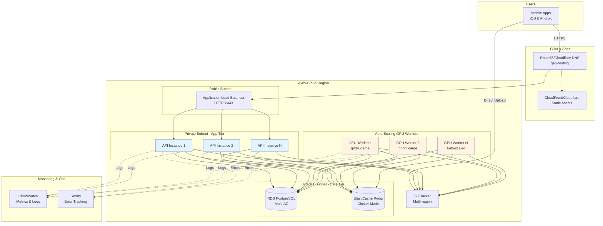

# Production Environment Setup

## Overview

The production environment is designed for scale, reliability, and security. It leverages managed services and auto-scaling to handle varying traffic loads while maintaining cost efficiency.

## Architecture Diagram



## Infrastructure as Code

We use **Terraform** for infrastructure provisioning and **AWS** as the primary cloud provider (adaptable to GCP/Azure).

### Directory Structure

```
Ascension/                      # Main repository
├── infrastructure/
│   ├── terraform/
│   │   ├── main.tf
│   │   ├── variables.tf
│   │   ├── outputs.tf
│   │   ├── modules/
│   │   │   ├── networking/
│   │   │   ├── database/
│   │   │   ├── storage/
│   │   │   ├── api/
│   │   │   └── workers/
│   │   └── environments/
│   │       ├── production.tfvars
│   │       └── production-eu.tfvars
│   ├── kubernetes/  # Optional: For EKS deployment
│   │   ├── api/
│   │   └── workers/
│   └── ansible/     # For VM configuration
│
├── server/                     # Submodule: API source code
├── ai/                         # Submodule: AI worker source code
├── mobile/                     # Submodule: Mobile app
├── docs/                       # Submodule: Documentation
└── benchmark/                  # Submodule: Benchmarks
```

## Core Components

### 1. Virtual Private Cloud (VPC)

```hcl
# terraform/modules/networking/main.tf

resource "aws_vpc" "main" {
  cidr_block           = "10.0.0.0/16"
  enable_dns_hostnames = true
  enable_dns_support   = true

  tags = {
    Name        = "ascension-vpc-${var.environment}"
    Environment = var.environment
  }
}

# Public Subnets (for Load Balancer)
resource "aws_subnet" "public" {
  count                   = 2
  vpc_id                  = aws_vpc.main.id
  cidr_block              = "10.0.${count.index + 1}.0/24"
  availability_zone       = data.aws_availability_zones.available.names[count.index]
  map_public_ip_on_launch = true

  tags = {
    Name = "ascension-public-${count.index + 1}"
  }
}

# Private Subnets (for API, Database, Workers)
resource "aws_subnet" "private" {
  count             = 2
  vpc_id            = aws_vpc.main.id
  cidr_block        = "10.0.${count.index + 10}.0/24"
  availability_zone = data.aws_availability_zones.available.names[count.index]

  tags = {
    Name = "ascension-private-${count.index + 1}"
  }
}

# Internet Gateway
resource "aws_internet_gateway" "main" {
  vpc_id = aws_vpc.main.id

  tags = {
    Name = "ascension-igw"
  }
}

# NAT Gateway (for outbound traffic from private subnets)
resource "aws_eip" "nat" {
  count  = 2
  domain = "vpc"
}

resource "aws_nat_gateway" "main" {
  count         = 2
  allocation_id = aws_eip.nat[count.index].id
  subnet_id     = aws_subnet.public[count.index].id

  tags = {
    Name = "ascension-nat-${count.index + 1}"
  }
}
```

### 2. Database (RDS PostgreSQL)

```hcl
# terraform/modules/database/main.tf

resource "aws_db_subnet_group" "main" {
  name       = "ascension-db-subnet"
  subnet_ids = var.private_subnet_ids

  tags = {
    Name = "Ascension DB Subnet Group"
  }
}

resource "aws_db_instance" "postgres" {
  identifier     = "ascension-db-${var.environment}"
  engine         = "postgres"
  engine_version = "15.4"

  instance_class    = var.db_instance_class  # db.t3.medium for production
  allocated_storage = 100
  storage_type      = "gp3"
  storage_encrypted = true

  db_name  = "ascension"
  username = var.db_username
  password = var.db_password

  multi_az               = true  # High availability
  publicly_accessible    = false
  vpc_security_group_ids = [aws_security_group.database.id]
  db_subnet_group_name   = aws_db_subnet_group.main.name

  backup_retention_period = 7
  backup_window           = "03:00-04:00"
  maintenance_window      = "Mon:04:00-Mon:05:00"

  deletion_protection     = true
  skip_final_snapshot     = false
  final_snapshot_identifier = "ascension-final-snapshot-${formatdate("YYYY-MM-DD-hhmm", timestamp())}"

  enabled_cloudwatch_logs_exports = ["postgresql", "upgrade"]

  tags = {
    Name        = "Ascension Production DB"
    Environment = var.environment
  }
}

# Read Replica for query distribution
resource "aws_db_instance" "postgres_replica" {
  identifier             = "ascension-db-replica-${var.environment}"
  replicate_source_db    = aws_db_instance.postgres.identifier
  instance_class         = var.db_instance_class
  publicly_accessible    = false
  vpc_security_group_ids = [aws_security_group.database.id]

  tags = {
    Name        = "Ascension Production DB Replica"
    Environment = var.environment
  }
}
```

### 3. Cache & Queue (ElastiCache Redis)

```hcl
# terraform/modules/cache/main.tf

resource "aws_elasticache_subnet_group" "redis" {
  name       = "ascension-redis-subnet"
  subnet_ids = var.private_subnet_ids
}

resource "aws_elasticache_replication_group" "redis" {
  replication_group_id       = "ascension-redis-${var.environment}"
  description                = "Redis cluster for Ascension"
  engine                     = "redis"
  engine_version             = "7.0"
  node_type                  = "cache.t3.medium"
  num_cache_clusters         = 2  # Primary + 1 replica
  port                       = 6379
  parameter_group_name       = "default.redis7"
  subnet_group_name          = aws_elasticache_subnet_group.redis.name
  security_group_ids         = [aws_security_group.redis.id]

  automatic_failover_enabled = true
  multi_az_enabled           = true
  at_rest_encryption_enabled = true
  transit_encryption_enabled = true
  auth_token                 = var.redis_auth_token

  snapshot_retention_limit   = 5
  snapshot_window            = "03:00-05:00"

  tags = {
    Name        = "Ascension Production Redis"
    Environment = var.environment
  }
}
```

### 4. Object Storage (S3)

```hcl
# terraform/modules/storage/main.tf

resource "aws_s3_bucket" "videos" {
  bucket = "ascension-videos-${var.environment}"

  tags = {
    Name        = "Ascension Video Storage"
    Environment = var.environment
  }
}

# Enable versioning
resource "aws_s3_bucket_versioning" "videos" {
  bucket = aws_s3_bucket.videos.id

  versioning_configuration {
    status = "Enabled"
  }
}

# Server-side encryption
resource "aws_s3_bucket_server_side_encryption_configuration" "videos" {
  bucket = aws_s3_bucket.videos.id

  rule {
    apply_server_side_encryption_by_default {
      sse_algorithm = "AES256"
    }
  }
}

# Lifecycle policy
resource "aws_s3_bucket_lifecycle_configuration" "videos" {
  bucket = aws_s3_bucket.videos.id

  rule {
    id     = "delete-unsaved-uploads"
    status = "Enabled"

    filter {
      prefix = "uploads/"
    }

    expiration {
      days = 1
    }
  }

  rule {
    id     = "archive-old-saves"
    status = "Enabled"

    filter {
      prefix = "saved/"
    }

    transition {
      days          = 30
      storage_class = "GLACIER_IR"
    }

    transition {
      days          = 90
      storage_class = "DEEP_ARCHIVE"
    }
  }
}

# CORS configuration
resource "aws_s3_bucket_cors_configuration" "videos" {
  bucket = aws_s3_bucket.videos.id

  cors_rule {
    allowed_headers = ["*"]
    allowed_methods = ["GET", "PUT", "POST", "DELETE"]
    allowed_origins = ["https://app.ascension.com", "https://*.ascension.com"]
    max_age_seconds = 3000
  }
}

# Block public access (we use presigned URLs only)
resource "aws_s3_bucket_public_access_block" "videos" {
  bucket = aws_s3_bucket.videos.id

  block_public_acls       = true
  block_public_policy     = true
  ignore_public_acls      = true
  restrict_public_buckets = true
}
```

### 5. API Server (ECS Fargate or EC2 Auto Scaling)

#### Option A: ECS Fargate (Serverless Containers)

```hcl
# terraform/modules/api/ecs.tf

resource "aws_ecs_cluster" "api" {
  name = "ascension-api-${var.environment}"

  setting {
    name  = "containerInsights"
    value = "enabled"
  }
}

resource "aws_ecs_task_definition" "api" {
  family                   = "ascension-api"
  network_mode             = "awsvpc"
  requires_compatibilities = ["FARGATE"]
  cpu                      = "1024"  # 1 vCPU
  memory                   = "2048"  # 2 GB
  execution_role_arn       = aws_iam_role.ecs_execution.arn
  task_role_arn            = aws_iam_role.ecs_task.arn

  container_definitions = jsonencode([{
    name  = "api"
    image = "${var.ecr_repository_url}:${var.image_tag}"

    portMappings = [{
      containerPort = 8080
      protocol      = "tcp"
    }]

    environment = [
      { name = "ENVIRONMENT", value = var.environment },
      { name = "RUST_LOG", value = "info" },
      { name = "S3_BUCKET", value = aws_s3_bucket.videos.id }
    ]

    secrets = [
      { name = "DATABASE_URL", valueFrom = aws_secretsmanager_secret_version.db_url.arn },
      { name = "REDIS_URL", valueFrom = aws_secretsmanager_secret_version.redis_url.arn },
      { name = "JWT_SECRET", valueFrom = aws_secretsmanager_secret_version.jwt_secret.arn }
    ]

    logConfiguration = {
      logDriver = "awslogs"
      options = {
        "awslogs-group"         = aws_cloudwatch_log_group.api.name
        "awslogs-region"        = var.aws_region
        "awslogs-stream-prefix" = "api"
      }
    }

    healthCheck = {
      command     = ["CMD-SHELL", "curl -f http://localhost:8080/health || exit 1"]
      interval    = 30
      timeout     = 5
      retries     = 3
      startPeriod = 60
    }
  }])
}

resource "aws_ecs_service" "api" {
  name            = "ascension-api"
  cluster         = aws_ecs_cluster.api.id
  task_definition = aws_ecs_task_definition.api.arn
  desired_count   = 3  # Run 3 instances minimum
  launch_type     = "FARGATE"

  network_configuration {
    subnets          = var.private_subnet_ids
    security_groups  = [aws_security_group.api.id]
    assign_public_ip = false
  }

  load_balancer {
    target_group_arn = aws_lb_target_group.api.arn
    container_name   = "api"
    container_port   = 8080
  }

  # Auto-scaling configuration
  deployment_configuration {
    maximum_percent         = 200
    minimum_healthy_percent = 100
  }

  depends_on = [aws_lb_listener.https]
}

# Auto Scaling
resource "aws_appautoscaling_target" "api" {
  max_capacity       = 10
  min_capacity       = 3
  resource_id        = "service/${aws_ecs_cluster.api.name}/${aws_ecs_service.api.name}"
  scalable_dimension = "ecs:service:DesiredCount"
  service_namespace  = "ecs"
}

resource "aws_appautoscaling_policy" "api_cpu" {
  name               = "ascension-api-cpu-scaling"
  policy_type        = "TargetTrackingScaling"
  resource_id        = aws_appautoscaling_target.api.resource_id
  scalable_dimension = aws_appautoscaling_target.api.scalable_dimension
  service_namespace  = aws_appautoscaling_target.api.service_namespace

  target_tracking_scaling_policy_configuration {
    predefined_metric_specification {
      predefined_metric_type = "ECSServiceAverageCPUUtilization"
    }
    target_value = 70.0
  }
}
```

### 6. Application Load Balancer

```hcl
# terraform/modules/api/alb.tf

resource "aws_lb" "main" {
  name               = "ascension-alb-${var.environment}"
  internal           = false
  load_balancer_type = "application"
  security_groups    = [aws_security_group.alb.id]
  subnets            = var.public_subnet_ids

  enable_deletion_protection = true
  enable_http2               = true
  enable_cross_zone_load_balancing = true

  tags = {
    Name        = "Ascension ALB"
    Environment = var.environment
  }
}

resource "aws_lb_target_group" "api" {
  name        = "ascension-api-tg"
  port        = 8080
  protocol    = "HTTP"
  vpc_id      = var.vpc_id
  target_type = "ip"  # For Fargate

  health_check {
    enabled             = true
    healthy_threshold   = 2
    interval            = 30
    matcher             = "200"
    path                = "/health"
    port                = "traffic-port"
    protocol            = "HTTP"
    timeout             = 5
    unhealthy_threshold = 3
  }

  deregistration_delay = 30
}

resource "aws_lb_listener" "https" {
  load_balancer_arn = aws_lb.main.arn
  port              = 443
  protocol          = "HTTPS"
  ssl_policy        = "ELBSecurityPolicy-TLS-1-2-2017-01"
  certificate_arn   = var.ssl_certificate_arn

  default_action {
    type             = "forward"
    target_group_arn = aws_lb_target_group.api.arn
  }
}

# Redirect HTTP to HTTPS
resource "aws_lb_listener" "http" {
  load_balancer_arn = aws_lb.main.arn
  port              = 80
  protocol          = "HTTP"

  default_action {
    type = "redirect"

    redirect {
      port        = "443"
      protocol    = "HTTPS"
      status_code = "HTTP_301"
    }
  }
}
```

### 7. GPU Workers (EC2 Auto Scaling)

```hcl
# terraform/modules/workers/main.tf

# Launch Template
resource "aws_launch_template" "gpu_worker" {
  name_prefix   = "ascension-gpu-worker-"
  image_id      = data.aws_ami.deep_learning.id  # Deep Learning AMI with CUDA
  instance_type = "g4dn.xlarge"

  iam_instance_profile {
    name = aws_iam_instance_profile.worker.name
  }

  vpc_security_group_ids = [aws_security_group.worker.id]

  user_data = base64encode(templatefile("${path.module}/user_data.sh", {
    REDIS_URL     = var.redis_url
    DATABASE_URL  = var.database_url
    S3_BUCKET     = var.s3_bucket
    AWS_REGION    = var.aws_region
  }))

  block_device_mappings {
    device_name = "/dev/sda1"

    ebs {
      volume_size           = 100
      volume_type           = "gp3"
      delete_on_termination = true
      encrypted             = true
    }
  }

  tag_specifications {
    resource_type = "instance"

    tags = {
      Name        = "Ascension GPU Worker"
      Environment = var.environment
    }
  }
}

# Auto Scaling Group
resource "aws_autoscaling_group" "gpu_workers" {
  name                = "ascension-gpu-workers-${var.environment}"
  vpc_zone_identifier = var.private_subnet_ids
  min_size            = 2
  max_size            = 10
  desired_capacity    = 3

  launch_template {
    id      = aws_launch_template.gpu_worker.id
    version = "$Latest"
  }

  health_check_type         = "EC2"
  health_check_grace_period = 300

  tag {
    key                 = "Name"
    value               = "Ascension GPU Worker"
    propagate_at_launch = true
  }

  tag {
    key                 = "Environment"
    value               = var.environment
    propagate_at_launch = true
  }
}

# Custom Scaling Policy (based on Redis queue depth)
resource "aws_autoscaling_policy" "scale_up" {
  name                   = "scale-up-on-queue-depth"
  scaling_adjustment     = 2
  adjustment_type        = "ChangeInCapacity"
  cooldown               = 300
  autoscaling_group_name = aws_autoscaling_group.gpu_workers.name
}

resource "aws_cloudwatch_metric_alarm" "queue_depth_high" {
  alarm_name          = "ascension-queue-depth-high"
  comparison_operator = "GreaterThanThreshold"
  evaluation_periods  = 2
  metric_name         = "QueueDepth"
  namespace           = "Ascension"
  period              = 60
  statistic           = "Average"
  threshold           = 50

  alarm_actions = [aws_autoscaling_policy.scale_up.arn]
}
```

## Security Configuration

### Security Groups

```hcl
# ALB Security Group
resource "aws_security_group" "alb" {
  name        = "ascension-alb-sg"
  description = "Security group for Application Load Balancer"
  vpc_id      = var.vpc_id

  ingress {
    from_port   = 443
    to_port     = 443
    protocol    = "tcp"
    cidr_blocks = ["0.0.0.0/0"]
    description = "HTTPS from internet"
  }

  ingress {
    from_port   = 80
    to_port     = 80
    protocol    = "tcp"
    cidr_blocks = ["0.0.0.0/0"]
    description = "HTTP from internet (redirect to HTTPS)"
  }

  egress {
    from_port   = 0
    to_port     = 0
    protocol    = "-1"
    cidr_blocks = ["0.0.0.0/0"]
  }
}

# API Security Group
resource "aws_security_group" "api" {
  name        = "ascension-api-sg"
  description = "Security group for API containers"
  vpc_id      = var.vpc_id

  ingress {
    from_port       = 8080
    to_port         = 8080
    protocol        = "tcp"
    security_groups = [aws_security_group.alb.id]
    description     = "Allow traffic from ALB"
  }

  egress {
    from_port   = 0
    to_port     = 0
    protocol    = "-1"
    cidr_blocks = ["0.0.0.0/0"]
  }
}

# Database Security Group
resource "aws_security_group" "database" {
  name        = "ascension-db-sg"
  description = "Security group for RDS PostgreSQL"
  vpc_id      = var.vpc_id

  ingress {
    from_port       = 5432
    to_port         = 5432
    protocol        = "tcp"
    security_groups = [aws_security_group.api.id, aws_security_group.worker.id]
    description     = "PostgreSQL from API and Workers"
  }

  egress {
    from_port   = 0
    to_port     = 0
    protocol    = "-1"
    cidr_blocks = ["0.0.0.0/0"]
  }
}

# Redis Security Group
resource "aws_security_group" "redis" {
  name        = "ascension-redis-sg"
  description = "Security group for ElastiCache Redis"
  vpc_id      = var.vpc_id

  ingress {
    from_port       = 6379
    to_port         = 6379
    protocol        = "tcp"
    security_groups = [aws_security_group.api.id, aws_security_group.worker.id]
    description     = "Redis from API and Workers"
  }

  egress {
    from_port   = 0
    to_port     = 0
    protocol    = "-1"
    cidr_blocks = ["0.0.0.0/0"]
  }
}

# Worker Security Group
resource "aws_security_group" "worker" {
  name        = "ascension-worker-sg"
  description = "Security group for GPU workers"
  vpc_id      = var.vpc_id

  egress {
    from_port   = 0
    to_port     = 0
    protocol    = "-1"
    cidr_blocks = ["0.0.0.0/0"]
  }
}
```

### Secrets Management

```hcl
# terraform/modules/secrets/main.tf

resource "aws_secretsmanager_secret" "db_credentials" {
  name        = "ascension/${var.environment}/db-credentials"
  description = "Database credentials for Ascension"

  recovery_window_in_days = 7
}

resource "aws_secretsmanager_secret_version" "db_credentials" {
  secret_id = aws_secretsmanager_secret.db_credentials.id
  secret_string = jsonencode({
    username = var.db_username
    password = var.db_password
    database = var.db_name
    host     = aws_db_instance.postgres.address
    port     = aws_db_instance.postgres.port
  })
}

resource "aws_secretsmanager_secret" "jwt_secret" {
  name = "ascension/${var.environment}/jwt-secret"
}

resource "aws_secretsmanager_secret_version" "jwt_secret" {
  secret_id     = aws_secretsmanager_secret.jwt_secret.id
  secret_string = var.jwt_secret
}
```

## Monitoring and Observability

### CloudWatch Dashboards

```hcl
resource "aws_cloudwatch_dashboard" "main" {
  dashboard_name = "Ascension-Production"

  dashboard_body = jsonencode({
    widgets = [
      {
        type = "metric"
        properties = {
          metrics = [
            ["AWS/ECS", "CPUUtilization", { stat = "Average" }],
            [".", "MemoryUtilization", { stat = "Average" }]
          ]
          period = 300
          region = var.aws_region
          title  = "API Container Resources"
        }
      },
      {
        type = "metric"
        properties = {
          metrics = [
            ["Ascension", "QueueDepth"],
            [".", "ProcessingTime"]
          ]
          period = 60
          region = var.aws_region
          title  = "AI Worker Metrics"
        }
      },
      {
        type = "metric"
        properties = {
          metrics = [
            ["AWS/RDS", "DatabaseConnections"],
            [".", "CPUUtilization"],
            [".", "FreeableMemory"]
          ]
          period = 300
          region = var.aws_region
          title  = "Database Metrics"
        }
      }
    ]
  })
}
```

### CloudWatch Alarms

```hcl
# High Error Rate
resource "aws_cloudwatch_metric_alarm" "api_errors" {
  alarm_name          = "ascension-api-high-error-rate"
  comparison_operator = "GreaterThanThreshold"
  evaluation_periods  = 2
  metric_name         = "5XXError"
  namespace           = "AWS/ApplicationELB"
  period              = 300
  statistic           = "Sum"
  threshold           = 10
  alarm_description   = "Alert when API error rate is high"
  alarm_actions       = [aws_sns_topic.alerts.arn]

  dimensions = {
    LoadBalancer = aws_lb.main.arn_suffix
  }
}

# Database CPU
resource "aws_cloudwatch_metric_alarm" "db_cpu" {
  alarm_name          = "ascension-db-high-cpu"
  comparison_operator = "GreaterThanThreshold"
  evaluation_periods  = 3
  metric_name         = "CPUUtilization"
  namespace           = "AWS/RDS"
  period              = 300
  statistic           = "Average"
  threshold           = 80
  alarm_description   = "Alert when database CPU is high"
  alarm_actions       = [aws_sns_topic.alerts.arn]

  dimensions = {
    DBInstanceIdentifier = aws_db_instance.postgres.id
  }
}

# SNS Topic for Alerts
resource "aws_sns_topic" "alerts" {
  name = "ascension-production-alerts"
}

resource "aws_sns_topic_subscription" "alerts_email" {
  topic_arn = aws_sns_topic.alerts.arn
  protocol  = "email"
  endpoint  = "ops@ascension.com"
}
```

## Deployment Process

### 1. Build and Push Docker Images

```bash
# Build API image
cd api
docker build -t ascension/api:${VERSION} -f Dockerfile --target production .

# Tag for ECR
docker tag ascension/api:${VERSION} ${AWS_ACCOUNT_ID}.dkr.ecr.${AWS_REGION}.amazonaws.com/ascension-api:${VERSION}

# Push to ECR
aws ecr get-login-password --region ${AWS_REGION} | docker login --username AWS --password-stdin ${AWS_ACCOUNT_ID}.dkr.ecr.${AWS_REGION}.amazonaws.com
docker push ${AWS_ACCOUNT_ID}.dkr.ecr.${AWS_REGION}.amazonaws.com/ascension-api:${VERSION}
```

### 2. Deploy Infrastructure

```bash
# Navigate to infrastructure directory
cd ../infrastructure/terraform

# Initialize Terraform
terraform init

# Plan deployment
terraform plan -var-file=environments/production.tfvars

# Apply changes
terraform apply -var-file=environments/production.tfvars
```

### 3. Deploy Application

```bash
# Update ECS service with new image
aws ecs update-service \
  --cluster ascension-api-production \
  --service ascension-api \
  --force-new-deployment \
  --task-definition ascension-api:${VERSION}
```

### 4. Run Database Migrations

```bash
# Using ECS task
aws ecs run-task \
  --cluster ascension-api-production \
  --task-definition ascension-migration:latest \
  --launch-type FARGATE \
  --network-configuration "awsvpcConfiguration={subnets=[subnet-xxx],securityGroups=[sg-xxx]}"
```

## CI/CD Pipeline (GitHub Actions)

**Note**: Each submodule can have its own CI/CD pipeline. The main repo has a unified deployment workflow.

### Per-Service Pipelines

**server/.github/workflows/ci.yml** (API repo):
```yaml
name: Server CI

on:
  push:
    branches: [main, develop]
  pull_request:
    branches: [main]

jobs:
  test:
    runs-on: ubuntu-latest
    steps:
      - uses: actions/checkout@v3
      - uses: actions-rs/toolchain@v1
        with:
          toolchain: stable
      - run: cargo test
      - run: cargo clippy
```

**ai/.github/workflows/ci.yml** (AI worker repo):
```yaml
name: AI Worker CI

on:
  push:
    branches: [main, develop]

jobs:
  test:
    runs-on: ubuntu-latest
    steps:
      - uses: actions/checkout@v3
      - uses: actions/setup-python@v4
        with:
          python-version: '3.11'
      - run: pip install -r requirements.txt
      - run: pytest
```

### Main Repo Deployment

**Ascension/.github/workflows/deploy-production.yml**:

```yaml
# .github/workflows/deploy-production.yml

name: Deploy to Production

on:
  push:
    tags:
      - 'v*'

jobs:
  build-and-deploy:
    runs-on: ubuntu-latest
    steps:
      - uses: actions/checkout@v3
        with:
          submodules: recursive  # Important: fetch all submodules

      - name: Configure AWS credentials
        uses: aws-actions/configure-aws-credentials@v2
        with:
          aws-access-key-id: ${{ secrets.AWS_ACCESS_KEY_ID }}
          aws-secret-access-key: ${{ secrets.AWS_SECRET_ACCESS_KEY }}
          aws-region: us-east-1

      - name: Login to Amazon ECR
        id: login-ecr
        uses: aws-actions/amazon-ecr-login@v1

      - name: Build and push API image
        env:
          ECR_REGISTRY: ${{ steps.login-ecr.outputs.registry }}
          IMAGE_TAG: ${{ github.ref_name }}
        run: |
          cd server
          docker build -t $ECR_REGISTRY/ascension-api:$IMAGE_TAG -f Dockerfile --target production .
          docker push $ECR_REGISTRY/ascension-api:$IMAGE_TAG

      - name: Build and push Worker image
        env:
          ECR_REGISTRY: ${{ steps.login-ecr.outputs.registry }}
          IMAGE_TAG: ${{ github.ref_name }}
        run: |
          cd ai
          docker build -t $ECR_REGISTRY/ascension-worker:$IMAGE_TAG .
          docker push $ECR_REGISTRY/ascension-worker:$IMAGE_TAG

      - name: Deploy to ECS
        run: |
          aws ecs update-service \
            --cluster ascension-api-production \
            --service ascension-api \
            --force-new-deployment

      - name: Wait for deployment
        run: |
          aws ecs wait services-stable \
            --cluster ascension-api-production \
            --services ascension-api
```

## Disaster Recovery

### Backup Strategy

**Database**:
- Automated daily snapshots (7-day retention)
- Point-in-time recovery enabled
- Cross-region replication for critical data

**S3**:
- Versioning enabled
- Cross-region replication
- MFA delete protection

**Configuration**:
- Terraform state in S3 with versioning
- Infrastructure as Code in Git

### Recovery Procedures

**Database Failure**:
1. RDS automatic failover to standby (< 2 minutes)
2. Or restore from snapshot

**Region Failure**:
1. Update DNS to point to secondary region
2. Launch infrastructure in DR region using Terraform
3. Restore database from cross-region replica

## Cost Optimization

### Strategies

1. **Spot Instances for GPU Workers**: Save 70%
2. **S3 Lifecycle Policies**: Move old data to Glacier
3. **Reserved Instances for Baseline Load**: Save 40%
4. **Auto-scaling**: Only pay for what you use
5. **CloudFront CDN**: Reduce data transfer costs

### Estimated Monthly Costs (100k active users)

```
ECS Fargate (API): 5 tasks × $50 = $250
RDS PostgreSQL (db.r5.large Multi-AZ): $400
ElastiCache Redis (cache.m5.large): $200
EC2 Spot Instances (GPU): 5 × $120 = $600
S3 Storage (50TB): $1,150
Data Transfer (100TB): $9,000
ALB: $50
Route53: $1
CloudWatch: $50
Total: ~$11,700/month ($0.117 per user)
```

## Security Best Practices

- [ ] All data encrypted at rest and in transit
- [ ] Secrets stored in AWS Secrets Manager
- [ ] IAM roles follow principle of least privilege
- [ ] VPC with private subnets for data tier
- [ ] Security groups restrict traffic to minimum required
- [ ] CloudTrail enabled for audit logging
- [ ] GuardDuty enabled for threat detection
- [ ] Regular security patches via automated updates
- [ ] WAF enabled on ALB to block common attacks
- [ ] DDoS protection via AWS Shield

## Next Steps

- Set up multi-region deployment for global users
- Implement blue-green deployments
- Add comprehensive E2E testing in CI/CD
- Set up Chaos Engineering tests

---

**Last Updated**: 2026-02-12
**Maintainer**: Ascension DevOps Team
