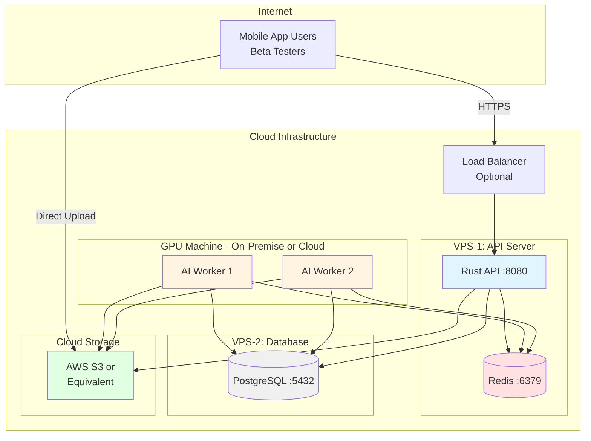
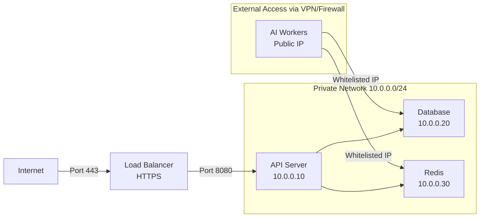

# Staging Environment Setup

## Overview

The staging environment mimics production architecture while remaining cost-effective. It separates API and AI workers onto different machines to validate distributed architecture patterns.

## Architecture Diagram



## Infrastructure Requirements

### VPS-1: API Server
- **CPU**: 2-4 vCPUs
- **RAM**: 4-8 GB
- **Storage**: 50 GB SSD
- **Network**: 100 Mbps
- **OS**: Ubuntu 22.04 LTS
- **Estimated Cost**: $20-40/month

### VPS-2: Database Server
- **CPU**: 2 vCPUs
- **RAM**: 4 GB (minimum for PostgreSQL)
- **Storage**: 100 GB SSD
- **Network**: 100 Mbps
- **OS**: Ubuntu 22.04 LTS
- **Estimated Cost**: $20-30/month

### GPU Machine (AI Workers)
Two options:

#### Option A: Cloud GPU Instance
- **Instance**: AWS EC2 g4dn.xlarge (or equivalent)
- **GPU**: NVIDIA T4 (16GB)
- **CPU**: 4 vCPUs
- **RAM**: 16 GB
- **Cost**: ~$0.526/hour (~$380/month full-time)
- **Cost Optimization**: Use Spot Instances (~$120/month)

#### Option B: On-Premise GPU Machine
- **PC**: Your Zephyrus G14 or similar
- **GPU**: RTX 3060+ or equivalent
- **Connection**: Stable internet connection
- **Cost**: $0 (hardware already owned)
- **Trade-off**: Must maintain uptime, potential home network limitations

### Object Storage
- **Service**: AWS S3, Backblaze B2, or Cloudflare R2
- **Storage**: ~500 GB
- **Requests**: ~100k/month
- **Estimated Cost**: $10-15/month

## Network Configuration

### VPS Network Setup



### Firewall Rules

**VPS-1 (API Server)**:
```bash
# Allow SSH (restrict to your IP)
sudo ufw allow from YOUR_IP to any port 22

# Allow HTTP/HTTPS
sudo ufw allow 80/tcp
sudo ufw allow 443/tcp

# Allow API port (if not behind load balancer)
sudo ufw allow 8080/tcp

# Allow Redis from private network
sudo ufw allow from 10.0.0.0/24 to any port 6379

# Enable firewall
sudo ufw enable
```

**VPS-2 (Database)**:
```bash
# Allow SSH (restrict to your IP)
sudo ufw allow from YOUR_IP to any port 22

# Allow PostgreSQL from API server
sudo ufw allow from 10.0.0.10 to any port 5432

# Allow PostgreSQL from Worker (if using public IP)
sudo ufw allow from WORKER_IP to any port 5432

sudo ufw enable
```

## Deployment Process

### 0. Prepare Codebase

#### Update Submodules

Before deploying, ensure all submodules are up to date:

```bash
# From Ascension root
cd /path/to/Ascension

# Update all submodules to latest commit
git submodule update --remote --merge

# Or update specific submodule
cd server
git pull origin main
cd ..
git add server
git commit -m "chore: update server submodule"
```

### 1. Prepare VPS Instances

#### Update System

```bash
# On both VPS-1 and VPS-2
sudo apt update && sudo apt upgrade -y
sudo apt install -y curl git build-essential
```

#### Install Docker

```bash
curl -fsSL https://get.docker.com -o get-docker.sh
sudo sh get-docker.sh
sudo usermod -aG docker $USER
```

Log out and back in for group changes to take effect.

### 2. Configure Database Server (VPS-2)

#### Deploy PostgreSQL

Create `docker-compose.yml`:

```yaml
version: '3.8'

services:
  postgres:
    image: postgres:15-alpine
    container_name: ascension-db
    environment:
      POSTGRES_USER: ${POSTGRES_USER}
      POSTGRES_PASSWORD: ${POSTGRES_PASSWORD}
      POSTGRES_DB: ${POSTGRES_DB}
    ports:
      - "5432:5432"
    volumes:
      - postgres_data:/var/lib/postgresql/data
      - ./backups:/backups  # For database backups
    restart: always
    command:
      - "postgres"
      - "-c"
      - "max_connections=200"
      - "-c"
      - "shared_buffers=256MB"
      - "-c"
      - "effective_cache_size=1GB"

volumes:
  postgres_data:
```

Create `.env`:

```bash
POSTGRES_USER=ascension
POSTGRES_PASSWORD=<GENERATE_STRONG_PASSWORD>
POSTGRES_DB=ascension_staging
```

Start database:

```bash
docker-compose up -d
```

#### Configure Remote Access

Edit `/var/lib/docker/volumes/ascension_postgres_data/_data/postgresql.conf` (inside container):

```conf
listen_addresses = '*'  # Listen on all interfaces
```

Or use Docker exec:

```bash
docker-compose exec postgres bash
echo "listen_addresses = '*'" >> /var/lib/postgresql/data/postgresql.conf
exit
docker-compose restart postgres
```

#### Set Up Automated Backups

Create `backup.sh`:

```bash
#!/bin/bash
DATE=$(date +%Y%m%d_%H%M%S)
BACKUP_DIR="/backups"
DB_NAME="ascension_staging"

docker-compose exec -T postgres pg_dump -U ascension ${DB_NAME} > ${BACKUP_DIR}/backup_${DATE}.sql

# Keep only last 7 days of backups
find ${BACKUP_DIR} -name "backup_*.sql" -mtime +7 -delete
```

Add to crontab:

```bash
chmod +x backup.sh
crontab -e
# Add: 0 2 * * * /path/to/backup.sh  # Daily at 2 AM
```

### 3. Configure API Server (VPS-1)

#### Set Up Environment Variables

Create `.env`:

```bash
# Database (VPS-2)
DATABASE_URL=postgresql://ascension:<password>@10.0.0.20:5432/ascension_staging

# Redis (local)
REDIS_URL=redis://127.0.0.1:6379

# Object Storage
S3_ENDPOINT=https://s3.amazonaws.com  # Or your provider
S3_REGION=us-east-1
S3_BUCKET=ascension-staging
AWS_ACCESS_KEY_ID=<your_key>
AWS_SECRET_ACCESS_KEY=<your_secret>

# API Configuration
API_HOST=0.0.0.0
API_PORT=8080
JWT_SECRET=<GENERATE_STRONG_SECRET>
RUST_LOG=info

# Environment
ENVIRONMENT=staging
```

#### Deploy API and Redis

Create `docker-compose.yml`:

```yaml
version: '3.8'

services:
  redis:
    image: redis:7-alpine
    container_name: ascension-redis
    command: redis-server --appendonly yes --requirepass ${REDIS_PASSWORD}
    ports:
      - "6379:6379"
    volumes:
      - redis_data:/data
    restart: always

  api:
    image: ascension/api:staging  # Build and push to registry
    container_name: ascension-api
    environment:
      DATABASE_URL: ${DATABASE_URL}
      REDIS_URL: redis://:${REDIS_PASSWORD}@redis:6379
      S3_ENDPOINT: ${S3_ENDPOINT}
      S3_REGION: ${S3_REGION}
      S3_BUCKET: ${S3_BUCKET}
      AWS_ACCESS_KEY_ID: ${AWS_ACCESS_KEY_ID}
      AWS_SECRET_ACCESS_KEY: ${AWS_SECRET_ACCESS_KEY}
      JWT_SECRET: ${JWT_SECRET}
      RUST_LOG: ${RUST_LOG}
    ports:
      - "8080:8080"
    depends_on:
      - redis
    restart: always
    healthcheck:
      test: ["CMD", "curl", "-f", "http://localhost:8080/health"]
      interval: 30s
      timeout: 10s
      retries: 3

volumes:
  redis_data:
```

#### Build and Push Docker Image

From your development machine:

```bash
# Build API from server submodule
cd Ascension/server

# Build for production
docker build -t ascension/api:staging -f Dockerfile --target production .

# Push to Docker Hub or private registry
docker tag ascension/api:staging your-registry/ascension-api:staging
docker push your-registry/ascension-api:staging
```

**Build AI Worker:**

```bash
cd ../ai
docker build -t ascension/worker:staging .
docker tag ascension/worker:staging your-registry/ascension-worker:staging
docker push your-registry/ascension-worker:staging
```

On VPS-1:

```bash
docker pull your-registry/ascension-api:staging
docker-compose up -d
```

### 4. Configure S3 Bucket

#### Create Bucket

```bash
# Using AWS CLI
aws s3 mb s3://ascension-staging --region us-east-1
```

#### Set Lifecycle Policy

Create `lifecycle.json`:

```json
{
  "Rules": [
    {
      "Id": "DeleteUnsavedVideos",
      "Status": "Enabled",
      "Filter": {
        "Prefix": "uploads/"
      },
      "Expiration": {
        "Days": 1
      }
    },
    {
      "Id": "ArchiveOldAnalyses",
      "Status": "Enabled",
      "Filter": {
        "Prefix": "saved/"
      },
      "Transitions": [
        {
          "Days": 30,
          "StorageClass": "GLACIER_IR"
        }
      ]
    }
  ]
}
```

Apply policy:

```bash
aws s3api put-bucket-lifecycle-configuration \
  --bucket ascension-staging \
  --lifecycle-configuration file://lifecycle.json
```

#### Configure CORS

Create `cors.json`:

```json
{
  "CORSRules": [
    {
      "AllowedOrigins": ["*"],
      "AllowedMethods": ["GET", "PUT", "POST", "DELETE"],
      "AllowedHeaders": ["*"],
      "MaxAgeSeconds": 3000
    }
  ]
}
```

Apply CORS:

```bash
aws s3api put-bucket-cors \
  --bucket ascension-staging \
  --cors-configuration file://cors.json
```

### 5. Set Up AI Workers

#### Option A: Cloud GPU Instance (AWS EC2)

**Launch Instance**:

```bash
# Using AWS CLI
aws ec2 run-instances \
  --image-id ami-0c55b159cbfafe1f0 \  # Deep Learning AMI
  --instance-type g4dn.xlarge \
  --key-name your-key-pair \
  --security-group-ids sg-xxxxxxxx \
  --subnet-id subnet-xxxxxxxx \
  --instance-market-options 'MarketType=spot'  # For cost savings
```

**SSH to Instance**:

```bash
ssh -i your-key.pem ubuntu@<instance-public-ip>
```

**Install Dependencies**:

```bash
# Already includes CUDA, cuDNN, PyTorch on Deep Learning AMI
git clone --recursive https://github.com/Ascension-EIP/Ascension.git
cd Ascension/ai
pip install -r requirements.txt
```

**Configure Environment**:

Create `.env`:

```bash
DATABASE_URL=postgresql://ascension:<password>@<VPS-2-IP>:5432/ascension_staging
REDIS_URL=redis://:<password>@<VPS-1-IP>:6379
S3_ENDPOINT=https://s3.amazonaws.com
S3_REGION=us-east-1
S3_BUCKET=ascension-staging
AWS_ACCESS_KEY_ID=<your_key>
AWS_SECRET_ACCESS_KEY=<your_secret>
WORKER_CONCURRENCY=4
```

**Run Worker**:

```bash
# Using systemd for auto-restart
sudo nano /etc/systemd/system/ascension-worker.service
```

```ini
[Unit]
Description=Ascension AI Worker
After=network.target

[Service]
Type=simple
User=ubuntu
WorkingDirectory=/home/ubuntu/Ascension/ai
EnvironmentFile=/home/ubuntu/Ascension/ai/.env
ExecStart=/usr/bin/python3 src/worker.py
Restart=always
RestartSec=10

[Install]
WantedBy=multi-user.target
```

```bash
sudo systemctl daemon-reload
sudo systemctl enable ascension-worker
sudo systemctl start ascension-worker
```

#### Option B: On-Premise GPU Machine (Zephyrus G14)

**Requirements**:
- Stable internet connection
- Port forwarding or VPN to reach VPS instances
- Power backup (UPS recommended)

**Installation**:

```bash
# On your local machine
cd ~/Ascension/ai
python3 -m venv venv
source venv/bin/activate
pip install -r requirements.txt
```

**Configure Network Access**:

Option 1: SSH Tunnel (Simple)

```bash
# Forward Redis and DB through SSH tunnel
ssh -L 5432:<VPS-2-PRIVATE-IP>:5432 user@<VPS-2-PUBLIC-IP> -N -f
ssh -L 6379:127.0.0.1:6379 user@<VPS-1-PUBLIC-IP> -N -f
```

Then use `localhost` in `.env`:

```bash
DATABASE_URL=postgresql://ascension:<password>@localhost:5432/ascension_staging
REDIS_URL=redis://:<password>@localhost:6379
```

Option 2: VPN (Recommended for Production-like Setup)

Set up WireGuard or OpenVPN to connect your local machine to the VPS network.

**Run Worker**:

```bash
python src/worker.py
```

Or use `supervisord` for process management:

```bash
sudo apt install supervisor
sudo nano /etc/supervisor/conf.d/ascension-worker.conf
```

```ini
[program:ascension-worker]
directory=/home/user/Ascension/ai
command=/home/user/Ascension/ai/venv/bin/python src/worker.py
autostart=true
autorestart=true
stderr_logfile=/var/log/ascension-worker.err.log
stdout_logfile=/var/log/ascension-worker.out.log
```

```bash
sudo supervisorctl reread
sudo supervisorctl update
sudo supervisorctl start ascension-worker
```

### 6. Set Up HTTPS (SSL/TLS)

#### Install Nginx

On VPS-1:

```bash
sudo apt install nginx certbot python3-certbot-nginx
```

#### Configure Nginx

Create `/etc/nginx/sites-available/ascension`:

```nginx
server {
    listen 80;
    server_name staging.ascension.app;  # Your domain

    location / {
        return 301 https://$server_name$request_uri;
    }
}

server {
    listen 443 ssl http2;
    server_name staging.ascension.app;

    ssl_certificate /etc/letsencrypt/live/staging.ascension.app/fullchain.pem;
    ssl_certificate_key /etc/letsencrypt/live/staging.ascension.app/privkey.pem;

    # API endpoints
    location /api/ {
        proxy_pass http://127.0.0.1:8080;
        proxy_set_header Host $host;
        proxy_set_header X-Real-IP $remote_addr;
        proxy_set_header X-Forwarded-For $proxy_add_x_forwarded_for;
        proxy_set_header X-Forwarded-Proto $scheme;
    }

    # WebSocket endpoint
    location /ws {
        proxy_pass http://127.0.0.1:8080;
        proxy_http_version 1.1;
        proxy_set_header Upgrade $http_upgrade;
        proxy_set_header Connection "Upgrade";
        proxy_set_header Host $host;
    }

    # Health check
    location /health {
        proxy_pass http://127.0.0.1:8080;
    }
}
```

Enable site:

```bash
sudo ln -s /etc/nginx/sites-available/ascension /etc/nginx/sites-enabled/
sudo nginx -t
sudo systemctl reload nginx
```

#### Get SSL Certificate

```bash
sudo certbot --nginx -d staging.ascension.app
```

Auto-renewal is configured automatically.

## Monitoring and Logging

### Set Up Log Aggregation

#### Install Loki + Grafana (Optional)

On VPS-1:

```yaml
# Add to docker-compose.yml
  loki:
    image: grafana/loki:latest
    ports:
      - "3100:3100"
    volumes:
      - loki_data:/loki

  grafana:
    image: grafana/grafana:latest
    ports:
      - "3000:3000"
    environment:
      - GF_SECURITY_ADMIN_PASSWORD=admin
    volumes:
      - grafana_data:/var/lib/grafana

volumes:
  loki_data:
  grafana_data:
```

Configure Loki in Grafana as data source.

### Application Metrics

Add Prometheus metrics to Rust API:

```toml
# Cargo.toml
[dependencies]
prometheus = "0.13"
axum-prometheus = "0.4"
```

Expose metrics endpoint:

```rust
// src/main.rs
use axum_prometheus::PrometheusMetricLayer;

let (prometheus_layer, metric_handle) = PrometheusMetricLayer::pair();

let app = Router::new()
    .route("/metrics", get(|| async move { metric_handle.render() }))
    .layer(prometheus_layer);
```

## Scaling Considerations

### Horizontal Scaling API

Update `docker-compose.yml` to run multiple API instances:

```yaml
api:
  # ... existing config ...
  deploy:
    replicas: 2  # Run 2 instances
```

Add Nginx upstream:

```nginx
upstream api_backend {
    least_conn;
    server 127.0.0.1:8080;
    server 127.0.0.1:8081;
}

location /api/ {
    proxy_pass http://api_backend;
}
```

### Add More AI Workers

Simply start additional worker processes on the same or different machines. They'll automatically consume from the same Redis queue.

## Cost Breakdown

### Minimal Setup (On-Premise GPU)

```
VPS-1 (API): $30/month
VPS-2 (DB): $25/month
S3 Storage: $12/month
Total: $67/month
```

### Cloud GPU Setup

```
VPS-1 (API): $30/month
VPS-2 (DB): $25/month
S3 Storage: $12/month
EC2 Spot (g4dn.xlarge): $120/month
Total: $187/month
```

## Deployment Checklist

- [ ] Provision VPS instances
- [ ] Configure firewalls and security groups
- [ ] Deploy PostgreSQL on VPS-2
- [ ] Set up automated database backups
- [ ] Deploy Redis on VPS-1
- [ ] Build and deploy Rust API
- [ ] Configure S3 bucket and lifecycle policies
- [ ] Set up AI workers (cloud or on-premise)
- [ ] Configure Nginx reverse proxy
- [ ] Obtain SSL certificate with Let's Encrypt
- [ ] Update Flutter app with staging API endpoint
- [ ] Verify end-to-end video analysis workflow
- [ ] Set up monitoring and alerting
- [ ] Document access credentials securely

## Testing Staging Environment

### Health Checks

```bash
curl https://staging.ascension.app/health
```

### Load Testing

Use tools like `k6` or `artillery`:

```bash
# Install k6
brew install k6

# Run load test
k6 run load-test.js
```

Example `load-test.js`:

```javascript
import http from 'k6/http';
import { check } from 'k6';

export let options = {
  stages: [
    { duration: '2m', target: 100 },  // Ramp up to 100 users
    { duration: '5m', target: 100 },  // Stay at 100 users
    { duration: '2m', target: 0 },    // Ramp down
  ],
};

export default function() {
  let res = http.get('https://staging.ascension.app/health');
  check(res, { 'status is 200': (r) => r.status === 200 });
}
```

## Next Steps

- Configure [Production Deployment](./production.md) for final launch
- Set up CI/CD pipeline for automated deployments
- Implement comprehensive monitoring and alerting

---

**Last Updated**: 2026-02-12
**Maintainer**: Ascension Development Team
