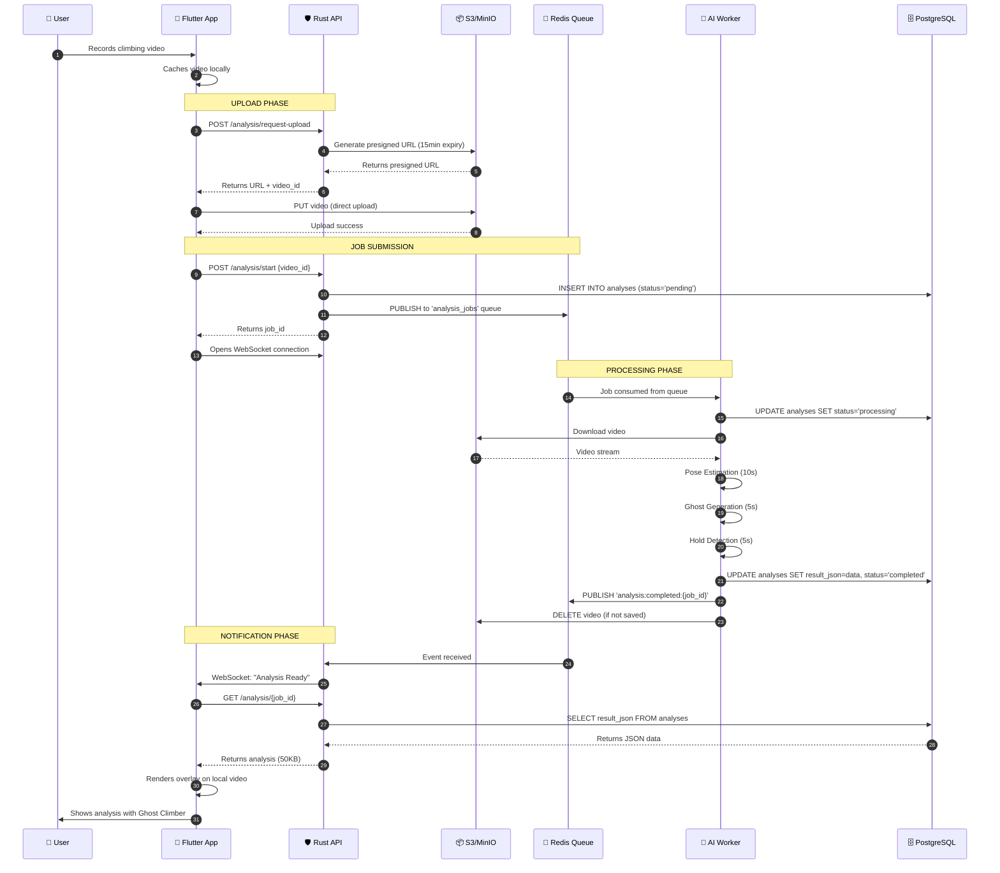

# System Overview

## Philosophy

Ascension's architecture is built on the principle of **separation of concerns** with a focus on **asynchronous processing** and **cost-effective scaling**. The system is designed to handle computationally expensive AI workloads without degrading user experience.

## Core Design Patterns

### 1. Event-Driven Architecture

The system uses an event-driven pattern where:
- User actions trigger events
- Events are published to a message queue
- Workers consume events asynchronously
- Results trigger completion events
- UI updates via WebSocket notifications

**Benefits**:
- Non-blocking user experience
- Natural load distribution
- Easy to add new event handlers
- Fault tolerance (retry failed events)

### 2. CQRS (Command Query Responsibility Segregation)

Commands (write operations) and Queries (read operations) follow different paths:

**Commands** (e.g., "Analyze this video"):
- API validates request
- Job published to queue
- Worker processes asynchronously
- Result stored in database

**Queries** (e.g., "Get my analysis"):
- API retrieves from database
- Response cached in Redis
- Direct to client

### 3. Client-Side Rendering

Instead of server-side video encoding, we return mathematical data:

**Traditional Approach** (Avoided):
```
Video (50MB) → AI Processing → Enhanced Video (50MB) → Client
Total bandwidth: 100MB
Processing time: 45s + encoding (30s)
```

**Our Approach**:
```
Video (50MB) → AI Processing → JSON (50KB) → Client renders overlay
Total bandwidth: 50MB
Processing time: 45s (no encoding)
```

**Savings per video**:
- Bandwidth: 50MB saved (50% reduction)
- Processing: 30s saved
- Storage: No need to keep processed videos

## System Layers

### Layer 1: Client (Flutter Mobile App)

**Responsibilities**:
- User interface and interaction
- Local video capture and caching
- Direct upload to object storage
- Rendering analysis overlays
- WebSocket connection for real-time updates

**Key Technologies**:
- Flutter SDK
- CustomPainter for overlay rendering
- WebSocket client
- HTTP/2 client

**Data Flow**:
1. Capture or select video
2. Keep video in local cache
3. Request presigned upload URL from API
4. Upload directly to S3/MinIO
5. Notify API of upload completion
6. Await WebSocket notification
7. Fetch JSON analysis
8. Render skeleton/ghost overlay on local video

### Layer 2: API Gateway (Rust)

**Responsibilities**:
- Authentication and authorization
- Request validation
- Presigned URL generation
- Job orchestration
- WebSocket connection management
- Result delivery

**Key Technologies**:
- Rust (Axum or Actix-web framework)
- JWT for authentication
- SQLx for database access
- Redis client for pub/sub

**NOT Responsible For**:
- Video processing (too heavy)
- Video storage (handled by object storage)
- AI inference (delegated to workers)

**API Endpoints**:
```
POST   /api/v1/auth/register
POST   /api/v1/auth/login
POST   /api/v1/analysis/request-upload     # Returns presigned URL
POST   /api/v1/analysis/start              # Triggers AI analysis
GET    /api/v1/analysis/:id                # Fetch results
WebSocket /api/v1/ws                        # Real-time notifications
```

### Layer 3: Message Queue (Redis)

**Responsibilities**:
- Job queue management
- Pub/Sub for events
- Session caching
- Rate limiting data

**Queue Pattern**:
```
Queue: analysis_jobs
Structure: {
  "job_id": "uuid",
  "user_id": "uuid",
  "video_url": "s3://bucket/path",
  "created_at": "timestamp",
  "options": {
    "generate_ghost": true,
    "detect_holds": true
  }
}
```

**Event Channels**:
- `analysis:started:{job_id}`
- `analysis:progress:{job_id}` (optional: for progress updates)
- `analysis:completed:{job_id}`
- `analysis:failed:{job_id}`

### Layer 4: AI Workers (Python)

**Responsibilities**:
- Consume jobs from queue
- Download video from object storage
- Run AI inference
- Generate analysis data
- Store results in database
- Publish completion event

**Worker Types**:

1. **Pose Estimation Worker**
   - Extracts skeleton keypoints frame-by-frame
   - Calculates joint angles
   - Identifies center of gravity
   - Output: JSON array of poses

2. **Ghost Climber Worker**
   - Takes pose data
   - Runs inverse kinematics
   - Generates optimal movement path
   - Output: JSON ghost overlay data

3. **Hold Recognition Worker**
   - Detects climbing holds in frame
   - Classifies hold types
   - Maps holds to 3D space
   - Output: JSON hold positions

**Worker Architecture**:
```python
class AnalysisWorker:
    def __init__(self):
        self.redis = Redis()
        self.s3 = S3Client()
        self.db = PostgresClient()

    def run(self):
        while True:
            job = self.redis.blocking_pop('analysis_jobs')
            self.process(job)

    def process(self, job):
        # Download video
        video = self.s3.download(job['video_url'])

        # Run AI
        poses = self.pose_estimator.analyze(video)
        ghost = self.ghost_generator.generate(poses)
        holds = self.hold_detector.detect(video)

        # Store results
        result = {
            'poses': poses,
            'ghost': ghost,
            'holds': holds
        }
        self.db.save_analysis(job['job_id'], result)

        # Notify completion
        self.redis.publish(f"analysis:completed:{job['job_id']}")

        # Cleanup
        self.s3.delete(job['video_url'])  # If not saved by user
```

### Layer 5: Data Persistence

#### PostgreSQL (Structured Data)

**Schema Design**:

```sql
-- Users table
CREATE TABLE users (
    id UUID PRIMARY KEY DEFAULT gen_random_uuid(),
    email VARCHAR(255) UNIQUE NOT NULL,
    password_hash VARCHAR(255) NOT NULL,
    created_at TIMESTAMP DEFAULT NOW(),
    subscription_tier VARCHAR(50) DEFAULT 'free'
);

-- Videos table
CREATE TABLE videos (
    id UUID PRIMARY KEY DEFAULT gen_random_uuid(),
    user_id UUID REFERENCES users(id),
    storage_url TEXT NOT NULL,
    duration_seconds INTEGER,
    file_size_bytes BIGINT,
    uploaded_at TIMESTAMP DEFAULT NOW(),
    saved BOOLEAN DEFAULT FALSE,
    expires_at TIMESTAMP  -- NULL if saved
);

-- Analysis results table
CREATE TABLE analyses (
    id UUID PRIMARY KEY DEFAULT gen_random_uuid(),
    video_id UUID REFERENCES videos(id),
    status VARCHAR(50) DEFAULT 'pending',  -- pending, processing, completed, failed
    result_json JSONB,  -- The actual analysis data
    processing_time_ms INTEGER,
    created_at TIMESTAMP DEFAULT NOW(),
    completed_at TIMESTAMP
);

-- Analysis metadata (for quick queries)
CREATE TABLE analysis_metrics (
    id UUID PRIMARY KEY DEFAULT gen_random_uuid(),
    analysis_id UUID REFERENCES analyses(id),
    max_reach_cm FLOAT,
    avg_tension FLOAT,
    movement_efficiency FLOAT,
    hold_count INTEGER
);
```

**Indexes**:
```sql
CREATE INDEX idx_videos_user_id ON videos(user_id);
CREATE INDEX idx_videos_expires_at ON videos(expires_at) WHERE saved = FALSE;
CREATE INDEX idx_analyses_video_id ON analyses(video_id);
CREATE INDEX idx_analyses_status ON analyses(status);
```

#### MinIO/S3 (Object Storage)

**Bucket Structure**:
```
ascension-videos/
├── uploads/
│   └── {user_id}/
│       └── {video_id}.mp4
├── saved/
│   └── {user_id}/
│       └── {video_id}.mp4
└── thumbnails/
    └── {video_id}.jpg
```

**Lifecycle Policies**:
```json
{
  "Rules": [
    {
      "Id": "DeleteUnsavedVideos",
      "Status": "Enabled",
      "Filter": {
        "Prefix": "uploads/"
      },
      "Expiration": {
        "Days": 1
      }
    }
  ]
}
```

## Data Flow: Complete Video Analysis



## Scaling Strategy

### Horizontal Scaling Points

1. **API Servers**: Add more instances behind load balancer
2. **AI Workers**: Add more worker processes/containers
3. **Database**: Read replicas for query distribution
4. **Object Storage**: Inherently scalable (S3/MinIO)
5. **Redis**: Redis Cluster for high availability

### Vertical Scaling Points

1. **AI Workers**: Upgrade to more powerful GPUs
2. **Database**: Increase RAM for larger cache
3. **Redis**: Increase memory for larger queue

### Auto-scaling Triggers

- **API**: CPU > 70% or Request Queue > 100
- **Workers**: Queue depth > 50 jobs
- **Database**: Connection pool saturation

## Fault Tolerance

### API Server Failure
- **Impact**: New requests fail
- **Mitigation**: Multiple API instances behind load balancer
- **Recovery**: Automatic (load balancer detects failure)

### AI Worker Failure
- **Impact**: Job remains in queue
- **Mitigation**: Job timeout + dead letter queue
- **Recovery**: Job reassigned to healthy worker

### Database Failure
- **Impact**: Cannot write/read results
- **Mitigation**: Database replica + automated failover
- **Recovery**: Promote replica to primary

### Object Storage Failure
- **Impact**: Cannot upload/download videos
- **Mitigation**: Multi-region replication (production)
- **Recovery**: Automatic (S3 SLA: 99.99%)

### Redis Failure
- **Impact**: Queue and cache unavailable
- **Mitigation**: Redis Sentinel for auto-failover
- **Recovery**: Promote replica, requeue in-flight jobs

## Security Architecture

### Authentication Flow

```
User → API: POST /auth/login {email, password}
API → DB: Verify credentials
API → API: Generate JWT (expires 24h)
API → User: Returns {access_token, refresh_token}

User → API: All requests include: Authorization: Bearer <token>
API → API: Verify JWT signature + expiry
API → DB: Fetch user permissions
```

### Authorization Levels

- **Free Tier**: 10 analyses/month, no Ghost Climber
- **Pro Tier**: Unlimited analyses, Ghost Climber, cloud saves
- **Enterprise**: API access, bulk processing, custom models

### Data Protection

- **In Transit**: TLS 1.3 for all external communication
- **At Rest**: Encrypted S3 buckets, encrypted DB volumes
- **Secrets**: Environment variables, never in code
- **API Keys**: Stored hashed with bcrypt

## Monitoring Strategy

### Key Metrics

**API**:
- Request rate (requests/second)
- Error rate (%)
- Response time (p50, p95, p99)
- Active WebSocket connections

**AI Workers**:
- Queue depth
- Processing time per video
- GPU utilization (%)
- Failed jobs count

**Database**:
- Query time (p50, p95)
- Connection pool usage
- Cache hit rate

**Object Storage**:
- Upload success rate
- Download bandwidth
- Storage used (GB)

### Alerting Rules

- API error rate > 5% for 5 minutes → Page on-call
- Queue depth > 200 jobs → Scale workers
- Database CPU > 80% for 10 minutes → Alert
- Storage approaching quota → Warning

## Cost Analysis

### Development Phase (Single Server)

```
VPS (8 CPU, 16GB RAM): $40/month
MinIO Storage (100GB): Included
Total: ~$40/month
```

### Production Phase (1,000 active users)

```
API Server (2x small instances): $60/month
Database (RDS equivalent): $50/month
Redis (managed): $30/month
S3 Storage (500GB @ $0.023/GB): $12/month
S3 Requests (100k uploads): $0.50/month
GPU Worker (1x g4dn.xlarge, spot): $120/month
Data Transfer (1TB): $90/month
Total: ~$362/month ($0.36 per user)
```

### Production Phase (100,000 active users)

```
API Servers (5x medium): $500/month
Database (Multi-AZ, read replicas): $400/month
Redis Cluster: $200/month
S3 Storage (50TB): $1,150/month
S3 Requests (10M uploads): $50/month
GPU Workers (10x g4dn.xlarge, spot): $1,200/month
Data Transfer (100TB): $9,000/month
Load Balancer: $50/month
Total: ~$12,550/month ($0.125 per user)
```

## Performance Benchmarks

### Target SLAs

- **API Response Time**: p95 < 200ms
- **Video Upload**: Network dependent (client → S3)
- **Analysis Processing**: < 30s for 30s video
- **WebSocket Notification**: < 100ms after completion
- **Result Fetch**: < 100ms
- **Total User Wait Time**: < 60s (upload + processing)

### Bottleneck Analysis

**Current Bottleneck**: GPU compute time
- **Solution**: Add more workers or upgrade GPUs

**Future Bottleneck** (at scale): Database writes
- **Solution**: Write batching, read replicas

## Technology Choices Rationale

### Why Rust over Node.js/Go?

**Vs Node.js**:
- No garbage collection pauses
- Memory safety without runtime overhead
- Better concurrency model (async/await without event loop)

**Vs Go**:
- More expressive type system
- Better memory safety guarantees
- Growing web ecosystem (Axum, Actix)

**Trade-off**: Slower development initially, but worth it for performance-critical API

### Why PostgreSQL over MongoDB?

- Structured data fits relational model
- ACID transactions for user accounts
- Better support for complex queries (JOIN user + video + analysis)
- JSONB support for flexible analysis data

### Why Redis over RabbitMQ?

- Simpler deployment
- Dual purpose (cache + queue)
- Pub/Sub for real-time notifications
- Better performance for our use case

### Why MinIO for Development?

- S3-compatible API (easy production migration)
- Self-hosted (no AWS costs during dev)
- Docker-friendly

## Next Steps

1. Read [Development Deployment](./deployment/development.md) to set up local environment
2. Review [API Gateway Documentation](./components/api-gateway.md) for implementation details
3. Understand [Video Analysis Workflow](./workflows/video-analysis-flow.md) for the complete flow

---

**Last Updated**: 2026-02-12
**Maintainer**: Ascension Development Team
