> **Last updated:** 12th February 2026  
> **Version:** 1.0  
> **Authors:** Gianni TUERO  
> **Status:** Done
> {.is-success}

# Video Analysis Workflow

## Overview

This document describes the complete end-to-end flow for video analysis, from user video recording to displaying the Ghost Climber overlay.

## Complete Sequence Diagram

```mermaid
sequenceDiagram
    autonumber
    actor User as 👤 User
    participant App as 📱 Flutter App
    participant API as 🛡️ Rust API
    participant S3 as 📦 S3 Storage
    participant Redis as 📨 Redis Queue
    participant Worker as 🤖 AI Worker
    participant DB as 🗄️ PostgreSQL

    Note over User,DB: PHASE 1: USER AUTHENTICATION
    User->>App: Opens app
    App->>API: POST /auth/login {email, password}
    API->>DB: Verify credentials (bcrypt)
    DB-->>API: User record
    API->>API: Generate JWT (24h expiry)
    API-->>App: {access_token, user_id}
    App->>App: Store token securely

    Note over User,S3: PHASE 2: VIDEO CAPTURE & CACHING
    User->>App: Records climbing video
    App->>App: Save to local cache (path: /cache/video_{id}.mp4)
    App->>User: Show preview

    Note over App,S3: PHASE 3: UPLOAD INITIATION
    User->>App: Taps "Analyze"
    App->>API: POST /analysis/request-upload<br/>{file_name, content_type, file_size}
    API->>API: Validate user quota (free: 10/month)
    API->>DB: INSERT INTO videos (user_id, status='pending')
    DB-->>API: video_id
    API->>S3: Generate presigned PUT URL (15min expiry)
    S3-->>API: presigned_url
    API-->>App: {video_id, upload_url, expires_at}

    Note over App,S3: PHASE 4: DIRECT VIDEO UPLOAD
    App->>S3: PUT <presigned_url> (video binary)
    S3->>S3: Validates signature & expiry
    S3-->>App: 200 OK / Upload complete
    App->>API: POST /analysis/confirm-upload {video_id}
    API->>DB: UPDATE videos SET storage_url, uploaded_at

    Note over API,Redis: PHASE 5: JOB SUBMISSION
    API->>DB: INSERT INTO analyses (video_id, status='pending')
    DB-->>API: analysis_id
    API->>Redis: LPUSH analysis_jobs<br/>{<br/>  job_id: analysis_id,<br/>  video_id: video_id,<br/>  user_id: user_id,<br/>  video_url: s3://bucket/path,<br/>  options: {ghost: true}<br/>}
    API-->>App: {analysis_id, status: 'pending'}

    Note over App,API: PHASE 6: WEBSOCKET CONNECTION
    App->>API: Upgrade to WebSocket /ws?token=jwt
    API->>API: Validate JWT, store connection
    API-->>App: WebSocket established
    App->>User: Shows "Processing..." UI

    Note over Redis,Worker: PHASE 7: WORKER CONSUMES JOB
    Worker->>Redis: BRPOP analysis_jobs (blocking wait)
    Redis-->>Worker: Job data
    Worker->>DB: UPDATE analyses SET status='processing', started_at
    Worker->>Redis: PUBLISH analysis:started:{job_id}
    Redis->>API: Event received
    API->>App: WebSocket: {event: 'started', progress: 0}

    Note over Worker,Worker: PHASE 8: AI PROCESSING
    Worker->>S3: GET video from storage_url
    S3-->>Worker: Video stream (progress: 10%)

    Worker->>Worker: Extract frames (ffmpeg)<br/>→ 900 frames @ 30fps (progress: 20%)

    Worker->>Worker: Pose Estimation (MediaPipe)<br/>→ Extract skeleton keypoints<br/>(progress: 30-60%)
    Note right of Worker: Per frame:<br/>- 33 keypoints (x, y, z, visibility)<br/>- Joint angles calculation<br/>- Center of gravity

    Worker->>Worker: Ghost Generation (IK Solver)<br/>→ Calculate optimal path<br/>(progress: 60-80%)
    Note right of Worker: - Inverse kinematics<br/>- Energy minimization<br/>- Trajectory smoothing

    Worker->>Worker: Hold Detection (CNN)<br/>→ Identify climbing holds<br/>(progress: 80-95%)
    Note right of Worker: - YOLO/SSD detection<br/>- Hold classification<br/>- 3D position mapping

    Note over Worker,DB: PHASE 9: RESULT STORAGE
    Worker->>Worker: Generate JSON result (progress: 95%)
    activate Worker
    Note right of Worker: JSON Structure:<br/>{<br/>  "poses": [frame-by-frame keypoints],<br/>  "ghost": [optimal movement path],<br/>  "holds": [detected holds],<br/>  "metrics": {reach, efficiency, etc}<br/>}
    deactivate Worker

    Worker->>DB: UPDATE analyses<br/>SET status='completed',<br/>result_json=$json,<br/>processing_time_ms,<br/>completed_at
    Worker->>DB: INSERT INTO analysis_metrics<br/>(extracted metadata)

    Worker->>Redis: PUBLISH analysis:completed:{job_id}

    Note over Worker,S3: PHASE 10: CLEANUP (if not saved)
    Worker->>DB: SELECT saved FROM videos WHERE id=$video_id
    DB-->>Worker: saved=false
    Worker->>S3: DELETE s3://bucket/uploads/{video_id}.mp4
    Note right of Worker: Lifecycle policy will also<br/>delete after 24h as backup

    Note over API,App: PHASE 11: NOTIFICATION
    Redis->>API: Event: analysis:completed
    API->>API: Lookup WebSocket connection for user
    API->>App: WebSocket: {event: 'completed', analysis_id}
    App->>App: Hide "Processing..." UI
    App->>User: Notification: "Analysis ready!"

    Note over App,DB: PHASE 12: RESULT RETRIEVAL
    User->>App: Taps "View results"
    App->>API: GET /analysis/{analysis_id}
    API->>DB: SELECT result_json FROM analyses<br/>WHERE id=$analysis_id AND user_id=$user_id
    DB-->>API: JSON data (~50KB)
    API-->>App: {<br/>  poses: [...],<br/>  ghost: [...],<br/>  holds: [...],<br/>  metrics: {...}<br/>}

    Note over App,App: PHASE 13: CLIENT-SIDE RENDERING
    App->>App: Load local cached video
    App->>App: Parse JSON (poses, ghost, holds)
    App->>App: Initialize VideoPlayer with CustomPainter
    activate App
    Note right of App: For each frame:<br/>1. Draw video frame<br/>2. Overlay skeleton (poses[frame])<br/>3. Overlay ghost (ghost[frame])<br/>4. Highlight holds<br/>5. Show metrics panel
    deactivate App
    App->>User: Displays analysis with Ghost overlay

    Note over User,DB: PHASE 14: OPTIONAL SAVE
    User->>App: Taps "Save for sharing"
    App->>API: POST /analysis/save {analysis_id}
    API->>DB: UPDATE videos SET saved=true, expires_at=NULL
    API->>S3: COPY uploads/{id} → saved/{id}
    API->>S3: Set ACL for sharing link
    S3-->>API: Saved URL
    API-->>App: {share_url, permanent: true}
    App->>User: "Saved! Share link copied"
```



## Detailed Phase Breakdown

### Phase 1: Authentication

**Purpose**: Verify user identity and establish session

**Flow**:

1. User enters credentials
2. API validates against database (bcrypt password check)
3. JWT token generated with claims:
   ```json
   {
     "sub": "user_id",
     "email": "user@example.com",
     "tier": "pro",
     "iat": 1707724800,
     "exp": 1707811200
   }
   ```
4. Token stored securely on client (iOS Keychain / Android KeyStore)

**Error Handling**:

- Invalid credentials → 401 Unauthorized
- Account locked → 423 Locked
- Rate limit exceeded → 429 Too Many Requests

---

### Phase 2: Video Capture

**Purpose**: Record climbing video locally

**Implementation** (Flutter):

```dart
import 'package:camera/camera.dart';

Future<File> recordVideo() async {
  final camera = await availableCameras().first;
  final controller = CameraController(camera, ResolutionPreset.high);

  await controller.initialize();
  await controller.startVideoRecording();

  // User climbs...

  final videoFile = await controller.stopVideoRecording();

  // Cache locally
  final appDir = await getApplicationDocumentsDirectory();
  final cachedPath = '${appDir.path}/cache/video_${uuid.v4()}.mp4';
  await videoFile.saveTo(cachedPath);

  return File(cachedPath);
}
```

**Constraints**:

- Max duration: 60 seconds (configurable)
- Max file size: 100MB
- Formats: MP4 (H.264 codec)
- Resolution: 720p-1080p recommended

---

### Phase 3: Upload Initiation

**Purpose**: Get secure upload URL without exposing credentials

**API Implementation** (Rust):

```rust
#[derive(Deserialize)]
struct UploadRequest {
    file_name: String,
    content_type: String,
    file_size: i64,
}

async fn request_upload(
    user: AuthenticatedUser,
    Json(req): Json<UploadRequest>,
    State(state): State<AppState>,
) -> Result<Json<UploadResponse>, AppError> {
    // Validate quota
    let usage = get_user_usage(&user.id, &state.db).await?;
    if usage.analyses_this_month >= user.tier.monthly_limit() {
        return Err(AppError::QuotaExceeded);
    }

    // Validate file
    if req.file_size > 100_000_000 {
        return Err(AppError::FileTooLarge);
    }

    // Create video record
    let video_id = Uuid::new_v4();
    let storage_key = format!("uploads/{}/{}.mp4", user.id, video_id);

    sqlx::query!(
        "INSERT INTO videos (id, user_id, storage_url, file_size_bytes)
         VALUES ($1, $2, $3, $4)",
        video_id, user.id, storage_key, req.file_size
    )
    .execute(&state.db)
    .await?;

    // Generate presigned URL
    let upload_url = state.s3_client.presigned_put(
        &state.config.s3_bucket,
        &storage_key,
        Duration::minutes(15),
    ).await?;

    Ok(Json(UploadResponse {
        video_id,
        upload_url,
        expires_at: Utc::now() + Duration::minutes(15),
    }))
}
```

---

### Phase 4: Direct Upload

**Purpose**: Upload video to S3 without hitting API server

**Client Implementation**:

```dart
Future<void> uploadVideoToS3(File video, String presignedUrl) async {
  final bytes = await video.readAsBytes();

  final response = await http.put(
    Uri.parse(presignedUrl),
    headers: {'Content-Type': 'video/mp4'},
    body: bytes,
  );

  if (response.statusCode != 200) {
    throw UploadException('Upload failed: ${response.body}');
  }
}
```

**Benefits**:

- API server doesn't handle large files
- Faster uploads (direct to S3)
- Reduced bandwidth costs
- Presigned URL security (time-limited, scoped)

---

### Phase 5: Job Submission

**Purpose**: Queue analysis job for async processing

**API Implementation**:

```rust
async fn start_analysis(
    user: AuthenticatedUser,
    Path(video_id): Path<Uuid>,
    State(state): State<AppState>,
) -> Result<Json<AnalysisResponse>, AppError> {
    // Verify ownership
    let video = get_video(&video_id, &state.db).await?;
    if video.user_id != user.id {
        return Err(AppError::Forbidden);
    }

    // Create analysis record
    let analysis_id = Uuid::new_v4();
    sqlx::query!(
        "INSERT INTO analyses (id, video_id, status)
         VALUES ($1, $2, 'pending')",
        analysis_id, video_id
    )
    .execute(&state.db)
    .await?;

    // Publish to Redis queue
    let job = AnalysisJob {
        job_id: analysis_id,
        user_id: user.id,
        video_id,
        video_url: format!("s3://{}/{}", state.config.s3_bucket, video.storage_url),
        options: AnalysisOptions {
            generate_ghost: user.tier.has_ghost_climber(),
            detect_holds: true,
        },
    };

    state.redis
        .lpush("analysis_jobs", serde_json::to_string(&job)?)
        .await?;

    Ok(Json(AnalysisResponse {
        analysis_id,
        status: "pending".to_string(),
    }))
}
```

---

### Phase 8: AI Processing

**Purpose**: Extract pose data, generate ghost, detect holds

**Worker Implementation** (Python):

```python
import cv2
import mediapipe as mp
import numpy as np
from typing import List, Dict

def process_video(video_path: str) -> Dict:
    # Initialize models
    mp_pose = mp.solutions.pose.Pose(
        static_image_mode=False,
        model_complexity=2,
        min_detection_confidence=0.5
    )

    # Extract frames
    cap = cv2.VideoCapture(video_path)
    frames = []
    poses = []

    while cap.isOpened():
        ret, frame = cap.read()
        if not ret:
            break

        # Pose estimation
        results = mp_pose.process(cv2.cvtColor(frame, cv2.COLOR_BGR2RGB))

        if results.pose_landmarks:
            # Extract keypoints
            landmarks = []
            for lm in results.pose_landmarks.landmark:
                landmarks.append({
                    'x': lm.x,
                    'y': lm.y,
                    'z': lm.z,
                    'visibility': lm.visibility
                })

            # Calculate angles
            angles = calculate_joint_angles(landmarks)

            # Calculate center of gravity
            cog = calculate_center_of_gravity(landmarks)

            poses.append({
                'keypoints': landmarks,
                'angles': angles,
                'center_of_gravity': cog
            })

        frames.append(frame)

    cap.release()

    # Generate ghost (optimal path)
    ghost = generate_ghost_climber(poses, frames)

    # Detect holds
    holds = detect_climbing_holds(frames)

    # Calculate metrics
    metrics = calculate_performance_metrics(poses, ghost)

    return {
        'poses': poses,
        'ghost': ghost,
        'holds': holds,
        'metrics': metrics
    }

def calculate_joint_angles(keypoints: List[Dict]) -> Dict:
    """Calculate angles for major joints"""
    # Right elbow: shoulder-elbow-wrist
    right_elbow = calculate_angle(
        keypoints[12],  # right shoulder
        keypoints[14],  # right elbow
        keypoints[16]   # right wrist
    )

    # Similar for other joints...
    return {
        'right_elbow': right_elbow,
        'left_elbow': calculate_angle(keypoints[11], keypoints[13], keypoints[15]),
        'right_knee': calculate_angle(keypoints[24], keypoints[26], keypoints[28]),
        # ... etc
    }

def generate_ghost_climber(poses: List[Dict], frames: List) -> List[Dict]:
    """
    Inverse kinematics solver to generate optimal movement
    """
    # This is the "magic" - optimize trajectory
    # Minimize: energy expenditure + time
    # Constraints: reach limits, balance, hold positions

    optimizer = InverseKinematicsSolver(
        body_model=load_human_body_model(),
        objective='minimize_energy'
    )

    optimal_path = optimizer.solve(poses, frames)

    return optimal_path
```

**Processing Time Breakdown**:

- Frame extraction: ~5 seconds (30s video @ 30fps = 900 frames)
- Pose estimation: ~20 seconds (900 frames × 22ms/frame)
- Ghost generation: ~5 seconds (IK solving)
- Hold detection: ~5 seconds (CNN inference)
- **Total**: ~35 seconds

---

### Phase 13: Client-Side Rendering

**Purpose**: Display analysis as overlay on original video

**Flutter Implementation**:

```dart
class AnalysisVideoPlayer extends StatefulWidget {
  final File videoFile;
  final AnalysisData analysis;

  @override
  _AnalysisVideoPlayerState createState() => _AnalysisVideoPlayerState();
}

class _AnalysisVideoPlayerState extends State<AnalysisVideoPlayer> {
  late VideoPlayerController _controller;

  @override
  void initState() {
    super.initState();
    _controller = VideoPlayerController.file(widget.videoFile)
      ..initialize().then((_) => setState(() {}));
  }

  @override
  Widget build(BuildContext context) {
    return Stack(
      children: [
        // Video layer
        VideoPlayer(_controller),

        // Overlay layer
        CustomPaint(
          painter: AnalysisOverlayPainter(
            currentFrame: (_controller.value.position.inMilliseconds / 33).floor(),
            poses: widget.analysis.poses,
            ghost: widget.analysis.ghost,
            holds: widget.analysis.holds,
          ),
        ),

        // Metrics panel
        Positioned(
          bottom: 80,
          left: 16,
          child: MetricsPanel(metrics: widget.analysis.metrics),
        ),
      ],
    );
  }
}

class AnalysisOverlayPainter extends CustomPainter {
  final int currentFrame;
  final List<PoseData> poses;
  final List<GhostData> ghost;
  final List<HoldData> holds;

  @override
  void paint(Canvas canvas, Size size) {
    if (currentFrame >= poses.length) return;

    final pose = poses[currentFrame];
    final ghostPose = ghost[currentFrame];

    // Draw user skeleton (blue)
    _drawSkeleton(canvas, size, pose.keypoints, Colors.blue);

    // Draw ghost skeleton (green, semi-transparent)
    _drawSkeleton(canvas, size, ghostPose.keypoints, Colors.green.withOpacity(0.6));

    // Draw holds (yellow circles)
    for (var hold in holds) {
      final paint = Paint()
        ..color = Colors.yellow
        ..style = PaintingStyle.stroke
        ..strokeWidth = 3;

      canvas.drawCircle(
        Offset(hold.x * size.width, hold.y * size.height),
        20,
        paint,
      );
    }

    // Draw joint angles
    _drawAngle(canvas, size, pose.angles['right_elbow'], pose.keypoints[14]);
  }

  void _drawSkeleton(Canvas canvas, Size size, List<Keypoint> keypoints, Color color) {
    final paint = Paint()
      ..color = color
      ..strokeWidth = 2
      ..strokeCap = StrokeCap.round;

    // Define skeleton connections
    final connections = [
      [11, 13], [13, 15],  // Left arm
      [12, 14], [14, 16],  // Right arm
      [23, 25], [25, 27],  // Left leg
      [24, 26], [26, 28],  // Right leg
      // ... etc
    ];

    for (var conn in connections) {
      final start = keypoints[conn[0]];
      final end = keypoints[conn[1]];

      if (start.visibility > 0.5 && end.visibility > 0.5) {
        canvas.drawLine(
          Offset(start.x * size.width, start.y * size.height),
          Offset(end.x * size.width, end.y * size.height),
          paint,
        );
      }
    }

    // Draw keypoints as circles
    for (var kp in keypoints) {
      if (kp.visibility > 0.5) {
        canvas.drawCircle(
          Offset(kp.x * size.width, kp.y * size.height),
          4,
          paint..style = PaintingStyle.fill,
        );
      }
    }
  }

  @override
  bool shouldRepaint(AnalysisOverlayPainter oldDelegate) {
    return currentFrame != oldDelegate.currentFrame;
  }
}
```

## Error Handling

### Upload Failures

```dart
try {
  await uploadVideoToS3(video, presignedUrl);
} on UploadException catch (e) {
  if (e.isNetworkError) {
    // Retry with exponential backoff
    await retryUpload(video, presignedUrl, maxAttempts: 3);
  } else if (e.isExpiredUrl) {
    // Request new presigned URL
    final newUrl = await requestNewUploadUrl(videoId);
    await uploadVideoToS3(video, newUrl);
  } else {
    // Show error to user
    showErrorDialog('Upload failed: ${e.message}');
  }
}
```

### Processing Failures

**Worker** (Python):

```python
try:
    result = process_video(video_path)
    save_result(job_id, result)
    publish_event('analysis:completed', job_id)
except Exception as e:
    logger.error(f"Processing failed for job {job_id}: {str(e)}")
    update_status(job_id, 'failed', error=str(e))
    publish_event('analysis:failed', job_id, reason=str(e))

    # Retry logic
    if is_retriable(e):
        requeue_job(job)
```

**Client**:

```dart
websocket.listen((event) {
  if (event['event'] == 'failed') {
    showDialog(
      context: context,
      builder: (_) => AlertDialog(
        title: Text('Analysis Failed'),
        content: Text(event['reason'] ?? 'Unknown error'),
        actions: [
          TextButton(
            onPressed: () => retryAnalysis(analysisId),
            child: Text('Retry'),
          ),
        ],
      ),
    );
  }
});
```

## Performance Optimizations

### 1. Video Compression

Compress video before upload:

```dart
import 'package:video_compress/video_compress.dart';

Future<File> compressVideo(File video) async {
  final info = await VideoCompress.compressVideo(
    video.path,
    quality: VideoQuality.MediumQuality,
    deleteOrigin: false,
  );

  return info!.file!;
}
```

### 2. Progressive Loading

Stream JSON parsing for large result files:

```dart
Stream<AnalysisData> parseAnalysisStream(String json) async* {
  final decoder = JsonDecoder();
  final parsed = decoder.convert(json);

  // Yield data progressively
  yield AnalysisData(
    poses: parsed['poses'],
    ghost: null,  // Load later
    holds: null,
  );

  await Future.delayed(Duration(milliseconds: 100));

  yield AnalysisData(
    poses: parsed['poses'],
    ghost: parsed['ghost'],
    holds: null,
  );

  await Future.delayed(Duration(milliseconds: 100));

  yield AnalysisData(
    poses: parsed['poses'],
    ghost: parsed['ghost'],
    holds: parsed['holds'],
  );
}
```

### 3. Worker Optimization

Use GPU batching:

```python
def process_batch(frames: List[np.ndarray]) -> List[PoseResult]:
    """Process multiple frames in one GPU call"""
    batch_tensor = np.stack(frames)
    results = pose_model(batch_tensor)  # Single GPU call
    return results
```

## Monitoring

### Key Metrics to Track

1. **Upload Success Rate**: % of successful uploads
2. **Processing Time**: p50, p95, p99 latencies
3. **Queue Depth**: Jobs waiting for processing
4. **Error Rate**: % of failed analyses
5. **User Drop-off**: % of users who abandon during processing

### Logging

**API**:

```rust
info!(
    user_id = %user.id,
    video_id = %video_id,
    analysis_id = %analysis_id,
    "Analysis job submitted"
);
```

**Worker**:

```python
logger.info(
    "Processing started",
    extra={
        'job_id': job_id,
        'video_size_mb': video_size / 1_000_000,
        'user_tier': user_tier,
    }
)
```

---

**Last Updated**: 2026-02-12
**Maintainer**: Ascension Development Team
